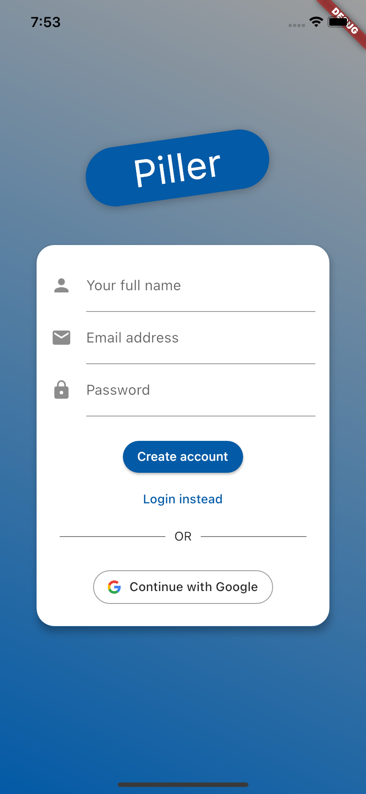

# Piller app

App helping you track your doses

*This app was created during [SMART HEALTH HACKATHON PRAGUE](https://www.ceehacks.com/)*
## Before running

This below are comments in progress

Install Dart

```sh
 brew tap dart-lang/dart
 brew install dart
```

Install Flutter

[Flutter installation guide](https://flutter.dev/docs/get-started/install)

Check metrics

```sh
pub global activate dart_code_metrics
```

## Running tests locally

Widget tests

```sh
flutter test widget
```

Unit tests

```sh
flutter test unit
```

Analyze code

```sh
flutter analyze
metrics lib
```

## Developing firebase

Tools:

```sh
npm install -g firebase-tools
```

Deploy

```sh
firebase deploy
```

## Screenshot


